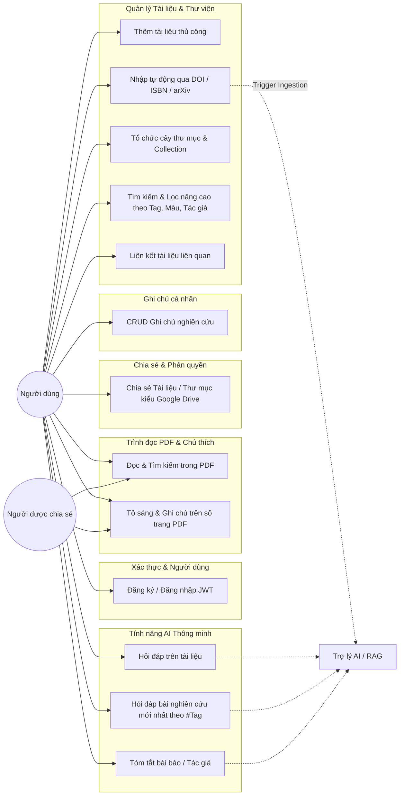
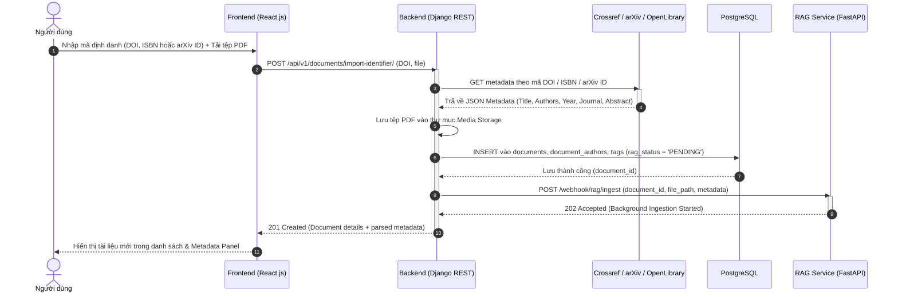
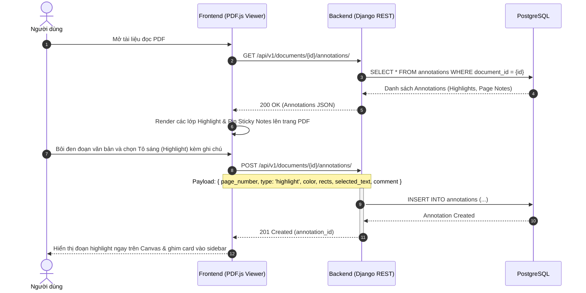
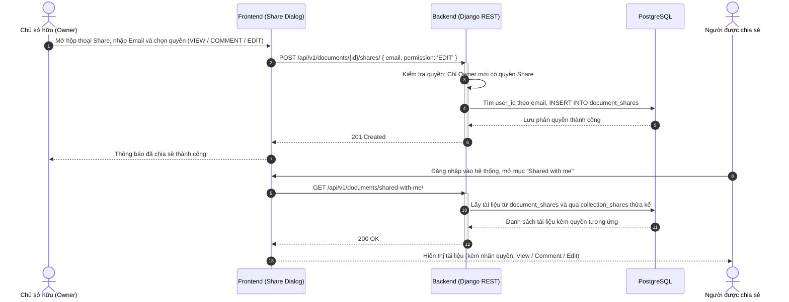
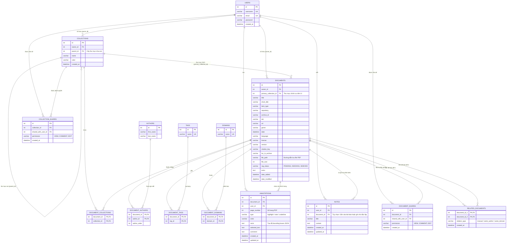

# Tài Liệu Thiết Kế Kiến Trúc Hệ Thống & Cơ Sở Dữ Liệu (Tuần 1)
**Dự án:** Hệ thống Quản lý Tài liệu Khoa học (Scientific Document Manager - Zotero Style with AI & Collaboration)

---

## 1. Tổng quan Kiến trúc Hệ thống (System Architecture)

Hệ thống được xây dựng theo mô hình phân tán hướng dịch vụ (Service-Oriented Architecture), kết hợp Web Client hiện đại (có lộ trình đóng gói Electron Desktop App), Backend nghiệp vụ quản lý dữ liệu tập trung, và dịch vụ AI/RAG phi đồng bộ:

```
+-------------------------------------------------------------------------+
|                Client Layer (React.js + TypeScript + Vite)              |
|   - Zotero-style 3-pane layout: Folders Tree, Document List, Metadata   |
|   - Real PDF.js Reader (Text layer, Search, Zoom, Page Navigation)      |
|   - Direct In-canvas PDF Annotation (Highlight, Sticky Notes on Page)   |
|   - Google Drive-style Share & Collaboration Dialog (View/Comment/Edit) |
|   - Chatbot & AI Assistant UI (Doc QnA, Tag QnA, Paper Summarizer)      |
+------------------------------------+------------------------------------+
                                     |
                                     | HTTPS / REST (JWT Auth)
                                     v
+-------------------------------------------------------------------------+
|                  Backend Core API (Django REST Framework)               |
|   - Authentication: SimpleJWT (Access & Refresh Tokens)                 |
|   - Permission Matrix: IsOwner, CanView, CanComment, CanEdit            |
|   - Metadata Ingestion: Crossref (DOI), OpenLibrary (ISBN), arXiv API   |
|   - Physical File Storage: Upload / Download / Stream PDF files         |
|   - Relational CRUD: Documents, Collections Tree, Tags, Notes, Shares   |
|   - Webhook Dispatcher: Bắn tín hiệu trigger indexing sang RAG Service  |
+-------------------+--------------------------------+--------------------+
                    |                                |
       ORM (SQL)    |                                | HTTP Webhook / Trigger
                    v                                v
+-----------------------------------+  +----------------------------------+
|   PostgreSQL Database             |  |   RAG Pipeline (FastAPI Microservice)
|   - Users & Auth Credentials      |  |   - Webhook Ingestion Receiver   |
|   - Hierarchical Collections Tree |  |   - PDF Text Chunking & Embedding|
|   - Document Metadata (22 fields) |  |   - LangChain Retrieval QA Chains|
|   - Annotations & Sticky Notes    |  |   - LLM Streaming (SSE/WebSocket)|
|   - Document & Folder Shares      |  +----------------+-----------------+
|   - Personal Notes & Relations    |                   |
+-----------------------------------+                   | Similarity Search
                                                        v
                                       +----------------------------------+
                                       |   Vector Database (Qdrant)       |
                                       |   - Collection: document_chunks  |
                                       |   - Dense Vectors (Cosine Dist)  |
                                       |   - Payload: doc_id, page, text  |
                                       +----------------------------------+
```

---

## 2. Sơ đồ Use Case & Sequence Diagrams

Dựa trên yêu cầu nghiệp vụ từ `funcs.txt` và sơ đồ tương tác thực tế từ `use_case_for_now.png`, hệ thống bao gồm các luồng tương tác chuẩn sau:

### 2.1. Sơ đồ Use Case Tổng Quan



---

### 2.2. Sequence Diagram: Thêm tài liệu (DOI / ISBN / arXiv) & Webhook Trigger RAG



---

### 2.3. Sequence Diagram: Đọc PDF, Highlight & Tạo Note trên trang



---

### 2.4. Sequence Diagram: Phân quyền chia sẻ tài liệu & thư mục kiểu Google Drive



---

## 3. Sơ đồ Quan hệ Thực thể (Entity Relationship Diagram - ERD)

Toàn bộ cấu trúc cơ sở dữ liệu quan hệ được ánh xạ từ `additional docs/thing.db` và `App_db.sql`:



---

## 4. Bảng Thiết Kế Chi Tiết REST API Endpoints

Hệ thống cung cấp chuẩn RESTful API với tiền tố `/api/v1/`:

### 4.1. Nhóm Xác thực & Người dùng (Authentication)

| Phương thức | Endpoint | Mô tả | Quyền truy cập |
| :--- | :--- | :--- | :--- |
| `POST` | `/api/v1/auth/register/` | Đăng ký tài khoản người dùng mới | Public |
| `POST` | `/api/v1/auth/token/` | Đăng nhập lấy cặp JWT Access & Refresh token | Public |
| `POST` | `/api/v1/auth/token/refresh/` | Cấp lại Access token mới từ Refresh token | Public |
| `GET` | `/api/v1/auth/me/` | Lấy thông tin tài khoản hiện tại | Authenticated |

---

### 4.2. Nhóm Quản lý Tài liệu & Tệp tin (Documents & Files)

| Phương thức | Endpoint | Tham số / Body | Mô tả & Trạng thái trả về |
| :--- | :--- | :--- | :--- |
| `GET` | `/api/v1/documents/` | `?collection_id=&tag=&search=&sort_by=&order=` | Lấy danh sách tài liệu người dùng sở hữu hoặc được chia sẻ |
| `POST` | `/api/v1/documents/` | `multipart/form-data`: `file`, metadata fields | Tạo tài liệu mới kèm upload file PDF |
| `GET` | `/api/v1/documents/{id}/` | URL param: `id` | Xem chi tiết 22 trường metadata bài báo |
| `PUT` / `PATCH` | `/api/v1/documents/{id}/` | JSON metadata fields cần cập nhật | Chỉnh sửa metadata (Yêu cầu quyền Owner hoặc `EDIT`) |
| `DELETE` | `/api/v1/documents/{id}/` | `?permanent=true/false` | Chuyển vào thùng rác (Trash) hoặc xóa vĩnh viễn (Chỉ Owner) |
| `GET` | `/api/v1/documents/{id}/download/`| - | Tải về tệp PDF vật lý gốc (Kiểm tra quyền `VIEW`) |

---

### 4.3. Nhóm Tự động Nhập Metadata (Auto DOI / ISBN / arXiv Lookup)

| Phương thức | Endpoint | Request Body | Mô tả nghiệp vụ |
| :--- | :--- | :--- | :--- |
| `POST` | `/api/v1/metadata/lookup-doi/` | `{ "doi": "10.1016/j.cell.2024.01" }` | Gọi **Crossref REST API** lấy tự động Title, Authors, Journal, Year, Abstract |
| `POST` | `/api/v1/metadata/lookup-isbn/`| `{ "isbn": "9780132350884" }` | Gọi **OpenLibrary API** lấy metadata sách |
| `POST` | `/api/v1/metadata/lookup-arxiv/`| `{ "arxiv_id": "2303.08774" }` | Gọi **arXiv Export API** lấy thông tin bài báo preprint |
| `POST` | `/api/v1/documents/import-quick/` | `multipart/form-data`: `identifier`, `type`, `file` | Nhập tài liệu 1 chạm: vừa tự fetch metadata, vừa lưu PDF và trigger AI |

---

### 4.4. Nhóm Cây Thư Mục & Bộ Sưu Tập (Collections Tree)

| Phương thức | Endpoint | Request Body | Mô tả |
| :--- | :--- | :--- | :--- |
| `GET` | `/api/v1/collections/tree/` | - | Lấy cấu trúc cây thư mục lồng nhau cha-con (Hierarchical Nested Tree) |
| `POST` | `/api/v1/collections/` | `{ "name": "AI Research", "parent_id": 1, "color": "#3b82f6" }` | Tạo thư mục mới (cấp 1 hoặc thư mục con) |
| `PATCH` | `/api/v1/collections/{id}/` | `{ "name": "Deep Learning", "color": "#10b981" }` | Đổi tên, đổi màu hoặc di chuyển thư mục cha |
| `DELETE` | `/api/v1/collections/{id}/` | - | Xóa thư mục |
| `POST` | `/api/v1/collections/{id}/add-documents/` | `{ "document_ids": [12, 15] }` | Thêm tài liệu vào thư mục |

---

### 4.5. Nhóm Chú Thích PDF (Annotations & Page Notes)

| Phương thức | Endpoint | Request Body | Mô tả |
| :--- | :--- | :--- | :--- |
| `GET` | `/api/v1/documents/{doc_id}/annotations/` | `?page_number=` | Lấy danh sách Highlight và Note theo trang của tài liệu |
| `POST` | `/api/v1/documents/{doc_id}/annotations/` | `{ "page_number": 2, "type": "highlight", "color": "#ffeb3b", "rects": "[{...}]", "selected_text": "...", "comment": "..." }` | Tạo highlight hoặc ghi chú gắn trên trang PDF (Quyền `COMMENT` hoặc `EDIT`) |
| `PATCH` | `/api/v1/annotations/{id}/` | `{ "color": "#f43f5e", "comment": "Update note..." }` | Cập nhật màu sắc hoặc nội dung comment |
| `DELETE` | `/api/v1/annotations/{id}/` | - | Xóa annotation |

---

### 4.6. Nhóm Ghi Chú Cá Nhân (Personal Notes)

| Phương thức | Endpoint | Request Body | Mô tả |
| :--- | :--- | :--- | :--- |
| `GET` | `/api/v1/notes/` | `?document_id=` | Lấy danh sách ghi chú của người dùng (có thể lọc theo tài liệu cụ thể) |
| `POST` | `/api/v1/notes/` | `{ "document_id": 5, "title": "Phân tích phương pháp", "content": "..." }` | Tạo ghi chú mới |
| `PUT` / `PATCH` | `/api/v1/notes/{id}/` | `{ "title": "...", "content": "..." }` | Sửa ghi chú |
| `DELETE` | `/api/v1/notes/{id}/` | - | Xóa ghi chú |

---

### 4.7. Nhóm Phân Quyền Chia Sẻ (Google Drive Style Sharing)

| Phương thức | Endpoint | Request Body | Mô tả |
| :--- | :--- | :--- | :--- |
| `GET` | `/api/v1/documents/{id}/shares/` | - | Xem danh sách người đang có quyền trên tài liệu |
| `POST` | `/api/v1/documents/{id}/shares/` | `{ "email": "colleague@univ.edu", "permission": "EDIT" }` | Chia sẻ tài liệu với quyền `VIEW`, `COMMENT`, hoặc `EDIT` |
| `DELETE` | `/api/v1/documents/{id}/shares/{share_id}/` | - | Thu hồi quyền chia sẻ tài liệu |
| `POST` | `/api/v1/collections/{id}/shares/` | `{ "email": "colleague@univ.edu", "permission": "VIEW" }` | Chia sẻ cả thư mục (Các tài liệu con tự động thừa hưởng quyền) |
| `GET` | `/api/v1/shares/shared-with-me/` | - | Lấy toàn bộ tài liệu & thư mục người khác chia sẻ cho tôi |

---

### 4.8. Nhóm Liên Kết Bài Báo Liên Quan (Related Items)

| Phương thức | Endpoint | Request Body | Mô tả |
| :--- | :--- | :--- | :--- |
| `GET` | `/api/v1/documents/{id}/related/` | - | Lấy danh sách các tài liệu liên quan (thủ công + cùng tác giả / domain) |
| `POST` | `/api/v1/documents/{id}/related/` | `{ "related_document_id": 28, "relation_type": "manual" }` | Gắn thủ công liên kết giữa 2 bài nghiên cứu |
| `DELETE` | `/api/v1/documents/{id}/related/{rel_id}/` | - | Hủy liên kết giữa 2 bài |

---

### 4.9. Nhóm Webhook Dispatcher & Giao Tiếp AI / RAG

| Phương thức | Endpoint | Hướng truyền nhận | Mô tả chức năng |
| :--- | :--- | :--- | :--- |
| `POST` | `/webhook/rag/ingest` | Backend -> RAG Service | Phát webhook thông báo tệp mới đã upload để RAG chạy background chunking & embedding |
| `POST` | `/webhook/rag/status-callback` | RAG Service -> Backend | Cập nhật `rag_status` về lại PostgreSQL (`INDEXED` hoặc `FAILED`) |
| `POST` | `/api/v1/ai/chat/document/` | Client -> RAG Service | Gửi câu hỏi Q&A trên nội dung 1 tài liệu cụ thể (Streaming response) |
| `POST` | `/api/v1/ai/chat/tag-collection/` | Client -> RAG Service | Hỏi đáp tổng hợp theo `#tag` trong 1 collection ("What's the newest study on #tag?") |
| `POST` | `/api/v1/ai/summarize/` | Client -> RAG Service | Yêu cầu tóm tắt toàn bộ bài báo hoặc tóm tắt hướng nghiên cứu của tác giả |

---

## 5. Thiết Kế Schema Vector Database (Qdrant)

Khi RAG Microservice nhận tín hiệu Webhook từ Backend:

1. **Collection Name**: `scientific_document_chunks`
2. **Vector Configuration**:
   - `size`: 1536 (đối với model `text-embedding-3-small` của OpenAI) hoặc 1024 (đối với model đa ngữ nguồn mở `bge-m3`).
   - `distance`: `Cosine`.
3. **Payload Structure** (Dữ liệu đính kèm mỗi vector chunk để hỗ trợ Payload Filter):
   ```json
   {
     "doc_id": 42,
     "owner_id": 3,
     "chunk_id": "doc_42_p1_c0",
     "page_number": 1,
     "chunk_index": 0,
     "section_title": "Abstract",
     "text_content": "Scientific and computational precision in medical artificial intelligence...",
     "authors": ["John Doe", "Jane Smith"],
     "tags": ["AI", "Biomedical"],
     "collection_ids": [2, 5],
     "created_at": "2026-09-17T12:00:00Z"
   }
   ```
4. **HNSW Indexing**: Bật Payload Index trên `doc_id`, `owner_id`, `tags`, và `collection_ids` để đảm bảo tốc độ truy vấn ngữ nghĩa dưới 10ms khi người dùng hỏi đáp trong phạm vi 1 bài báo hoặc cả bộ sưu tập.
