# System Architecture & Database Design Document
**Project:** Scientific Document Management System (Zotero Style with Local AI)  
**Version:** 2.0 (Midterm Architecture & Embedded Local RAG Integration)  
**Last Updated:** 2026-09-22

---

## 1. System Architecture Overview

The system is engineered as a **Modular Monolith** combining a React 19 single-page application, a Django 5 REST backend, and a locally embedded RAG pipeline. RAG orchestration and vector storage are integrated into the backend deployment, while LLM inference is provided by the **separate local Ollama service** (an independent OS process accessed over HTTP):

```
                                            +───────────────────────────────+
                                            │   Crossref REST API           │
                                            │   (Global DOI Metadata Cloud) │
                                            +───────────────▲───────────────+
                                                            │
                                                            │ HTTPS (DOI Lookup)
                                                            │
+───────────────────────────────────────────────────────────┴─────────────────+
│                  Client Layer (React 19 + TypeScript + Vite)                │
│  - Zotero-style 3-column layout: Folders Tree, Document Table, Metadata     │
│  - PDF.js Integrated Viewer: Canvas rendering, TextLayer, Smooth Zoom       │
│  - In-canvas Annotation: Text highlights, Boundary-clamped Sticky Notes     │
│  - Document Metadata Panel: Review & edit document-level bibliographic metadata  │
│  - AI Assistant Panel (<AiChatPanel>): Chat Q&A, 1-Click Summary, Citations │
+──────────────────────────────────────┬──────────────────────────────────────+
                                       │ HTTPS / REST (JWT Auth)
                                       ▼
+─────────────────────────────────────────────────────────────────────────────+
│            Backend Core API (Django 5 DRF Modular Monolith)                 │
│  - Authentication & Token Management: SimpleJWT (Rotation & blacklist logout)│
│  - Core Services: Document CRUD, Hierarchical Collections Tree, Tags, Notes │
│  - Physical File Validation: Magic bytes check (%PDF-), 50MB size limit     │
│  - Crossref Adapter: Automated metadata retrieval and DOI normalization     │
│  - Background RAG Task: In-process thread for asynchronous indexing        │
│    (Midterm implementation; no external task queue)                         │
+───────────────────────┬───────────────────────────────┬─────────────────────+
                        │                               │
           ORM (SQL)    │                               │ In-Process Background Thread
                        │                               │ (No external queue)
                        ▼                               ▼
+───────────────────────────────────+   +─────────────────────────────────────+
│   PostgreSQL 16 Database          │   │   Embedded RAG Pipeline (rag_service│
│   - Users & Authentication        │   │   - PyMuPDF (fitz) sort=True        │
│   - Hierarchical Collections Tree │   │   - RecursiveCharacterTextSplitter  │
│   - Document Records & Metadata           │   │   - all-MiniLM-L6-v2 (384-dim)      │
│   - Annotations & Sticky Notes    │   │   - Qdrant Embedded Vector Store    │
│   - Personal Research Notes       │   +──────────────────┬──────────────────+
│   - Authors, Tags & Domains       │                      │ Local REST /v1
+───────────────────────────────────+                      ▼
                                        +─────────────────────────────────────+
                                        │   Local LLM Inference (Ollama)      │
                                        │   - Model: llama3.2:3b              │
                                        │   - http://localhost:11434/v1       │
                                        +─────────────────────────────────────+
```

---

## 1.1. Actor Specification Table

The midterm system has one primary external human actor: **Researcher**. Internal services and infrastructure components (Django, RAG pipeline, Qdrant, Ollama, Crossref) are modeled separately in the system architecture diagrams.

| Actor | Role Type | Description & Responsibilities | Key Interactions |
| :--- | :--- | :--- | :--- |
| **Researcher** | Primary Human Actor | Main authenticated user managing their personal scientific library. | Registers/logs in via JWT, uploads PDFs, fetches DOI metadata, organizes collection trees, annotates text, queries documents via AI assistant, and generates AI summaries from key sections. |

> [!NOTE]
> **Scope Reduction & Feature Deferral:**
> Multi-user collaboration, live peer invites, and granular permission sharing (`VIEW`, `COMMENT`, `EDIT`) are formally **deferred to post-midterm releases**. The system scope is strictly optimized around the single-user researcher workflow and the core embedded RAG AI pipeline. See **Appendix A** for post-midterm extension designs.

---

## 1.2. System Use Case Diagrams

The system use cases are structured into two distinct views: a **High-Level Presentation View** (tailored for academic evaluation and midterm defense) and a **Comprehensive Detailed Specification View** (for functional requirement traceability).

### 1.2A. Midterm Presentation Use Case Diagram (High-Level)

This diagram showcases the core user capabilities across the 4 active functional domains:

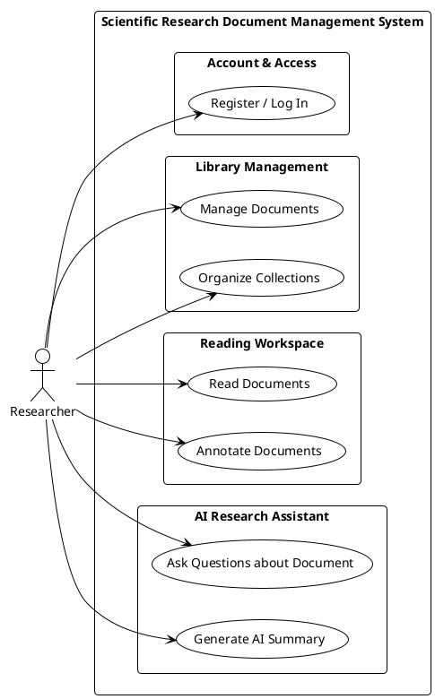

---

### 1.2B. Detailed System Use Case Specification View

This diagram provides granularity across the specific user-facing functions demonstrated by the system (e.g., DOI metadata import, PDF upload, in-canvas annotation, and AI document Q&A):

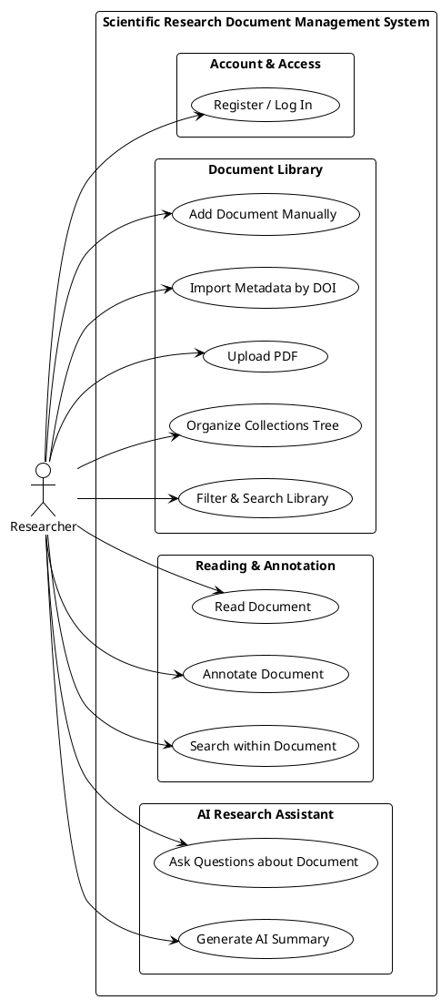

---

## 2. System & RAG Architecture Diagrams

### 2.1. Core System Component Architecture — Modular Monolith (PlantUML)

> [!IMPORTANT]
> **Core System Mental Model:**
> *"A Zotero-style scientific document manager implemented as a Django modular monolith, with a local RAG pipeline for document indexing and document-scoped AI Q&A, using embedded Qdrant for vector storage and Ollama for local LLM inference."*

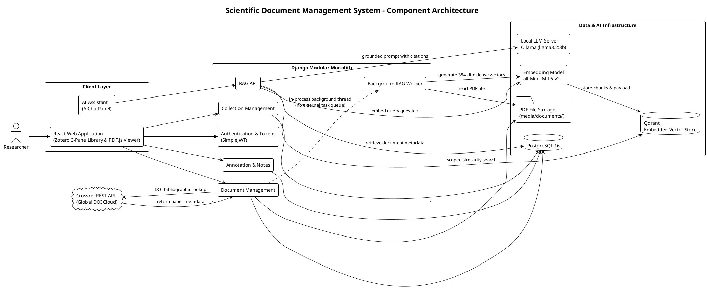

### 2.1B. Technical Specifications & Engineering Parameters

To maintain a clean separation of concerns, the low-level implementation constants and parameters supporting the architecture are organized below:

| Architectural Component | Engineering Parameter | Implementation Value / Standard | Rationale & Tradeoff |
| :--- | :--- | :--- | :--- |
| **PDF Text Extraction** | Library & Sorting Mode | `PyMuPDF` (`fitz`), `sort=True` | Coordinates-based sorting improves positional reading order for multi-column academic PDF layouts without requiring OCR. |
| **Chunking Strategy** | Splitter & Window Size | `RecursiveCharacterTextSplitter`<br>• Chunk Size: `~900` chars<br>• Overlap: `~150` chars | 900 characters roughly corresponds to 1–2 coherent scientific paragraphs, balancing dense context with high retrieval precision. |
| **Embedding Model** | Vector Dimensions & Metric | `sentence-transformers/all-MiniLM-L6-v2`<br>• Dims: `384`<br>• Metric: `Cosine` | Lightweight 384-dimensional model suitable for local inference without an external embedding API dependency. |
| **Vector Database** | Engine & Storage Path | `Qdrant Embedded`<br>• Storage: `media/qdrant_db/`<br>• Collection: `scientific_document_chunks` | In-process embedded storage avoids external Docker dependencies for the local development and midterm demo phases. |
| **Local LLM Inference** | Server & Model | `Ollama`<br>• Model: `llama3.2:3b`<br>• API: `http://localhost:11434/v1` | Runs as an independent local OS daemon; accessed over standard OpenAI-compatible REST `/v1/chat/completions`. |
| **File Integrity** | Size Limit & Magic Bytes | `50MB` limit, `.pdf` extension, `%PDF-` magic byte inspection | Prevents non-PDF or renamed binary files from reaching the parser or polluting storage. |
| **Retrieval Top-K** | Scoped Similarity Results | • Document Q&A: `Top-4` chunks<br>• Semantic Search: `Top-10` chunks | Implementation defaults chosen to limit retrieval context and keep prompt tokens compact for local LLM inference. |

---

## 2.2. RAG Processing Flows (Activity Diagrams)

### 2.2A. RAG Ingestion Pipeline (Activity Diagram)

This process executes when a new research document enters the system, converting raw PDF pages into an indexed vector representation:

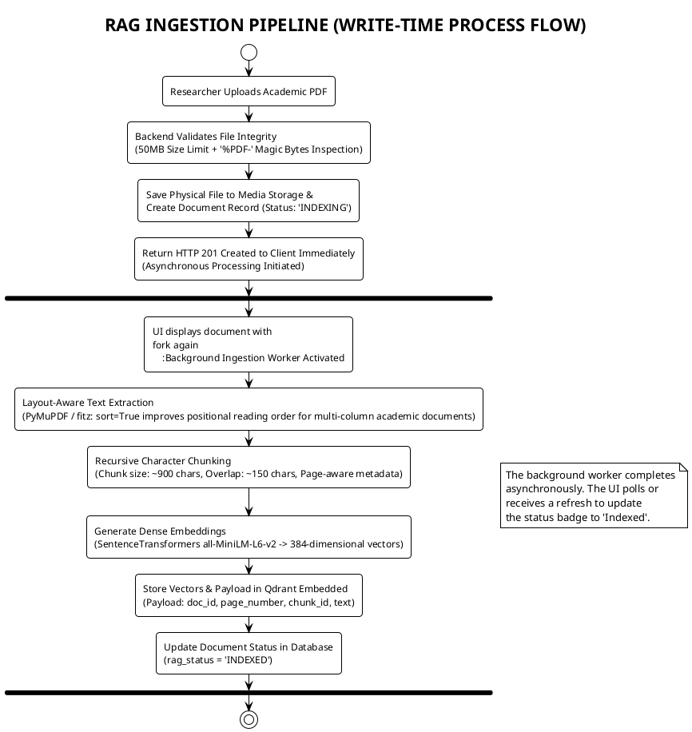

---

### 2.2B. RAG Retrieval & Grounded Q&A Pipeline (Activity Diagram)

This process executes when a user queries the AI Assistant, retrieving grounded evidence and generating answers with clickable page citations:

```plantuml
@startuml RAG_Retrieval_Pipeline
!theme plain
skinparam roundcorner 8
skinparam shadowing false

title RAG RETRIEVAL & GROUNDED Q&A PIPELINE (READ-TIME PROCESS FLOW)

start
:Researcher Submits Question in AiChatPanel;
:Bind Active Document Context (doc_id)
from Current PDF Viewer;
:Generate Query Embedding
(all-MiniLM-L6-v2 -> 384-dim dense vector);
:Execute Scoped Similarity Search in Qdrant
(Cosine distance, Payload Filter: doc_id == active_doc_id);
:Retrieve Top-K Most Relevant Chunks
(with chunk_id, page_number, chunk_text, score);
:Build Source Map from Chunk Metadata
(S1 → chunk_id → page 3, S2 → chunk_id → page 5, ...);
:Assemble Grounded Context Prompt
(Context chunks labelled [S1], [S2], ... for LLM to reference);
:Local LLM Inference via Ollama
(llama3.2:3b via OpenAI-compatible REST API);
:LLM Returns Answer Referencing [S1], [S2]
(Backend, not LLM, resolves source IDs to page numbers);
:Backend Maps [S1], [S2] → Page Numbers from Chunk Metadata;
:Render Chat Response with Interactive [Page 3], [Page 5] Badges;

if (User clicks [Page X] Badge?) then (yes)
    :Trigger scrollToPage(X) in PDF.js Viewer;
    :Scroll Document Canvas to Referenced Page;
else (no)
endif

stop

@enduml
```

---

## 3. Sequence Diagrams

> [!TIP]
> **Midterm Presentation Guidance:**
> For the midterm defense, prioritize presenting **3.1 (PDF Ingestion & Indexing)** and **3.2 (Document Q&A with Page Citations)** to demonstrate the core end-to-end RAG workflow. Diagram **3.3 (Annotation Persistence)** demonstrates document interaction and reading persistence. Advanced specifications like **Semantic Library Search** and **Multi-User Collaboration** are documented in **Appendix A** as roadmap extensions.

### 3.1. Sequence Diagram: PDF Ingestion & Automated Vector Indexing (PlantUML)

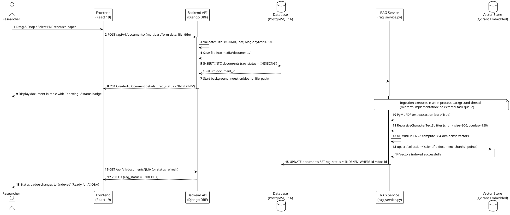

---

### 3.2. Sequence Diagram: Document Q&A with AI Assistant & Page Citations (PlantUML)

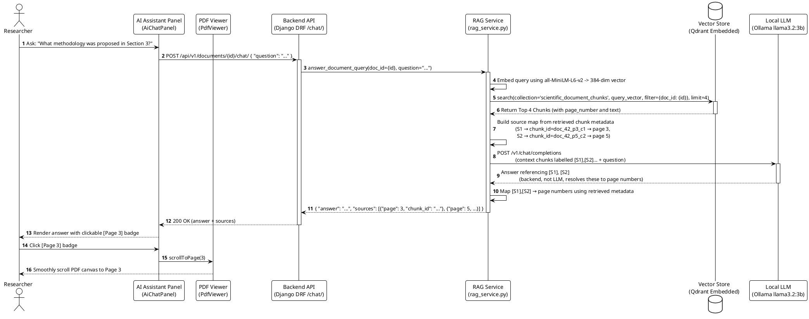

---

### 3.3. Sequence Diagram: PDF Annotation & Note Persistence (PlantUML)

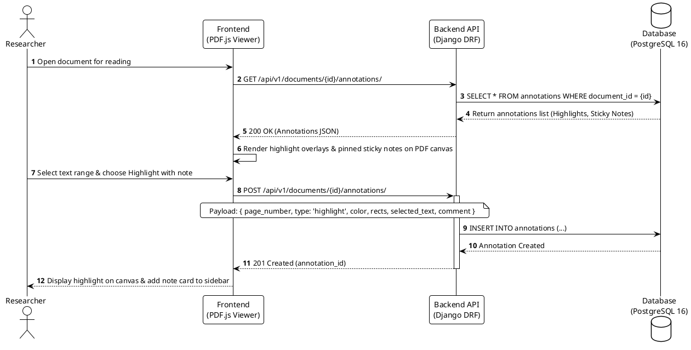

---

> [!NOTE]
> Detailed sequence specifications for future and roadmap capabilities (**A.1 Collaboration & Document Sharing** and **A.2 Semantic Library Search**) are documented in **Appendix A — Post-Midterm Extension Design** at the end of this document.


## 4. Entity Relationship Diagrams (ERD)

The system's data architecture is organized into a **Conceptual Domain Model** showing core entities and business relationships, and an **Application-Level Relational Schema** specifying the database structure implemented via Django ORM.

> [!NOTE]
> **Database Schema Scope — Active Midterm (12 Tables) vs. Post-Midterm Extensions (3 Tables):**
> To ensure strict consistency between demonstrated features and schema documentation:
> 1. **Active Midterm Schema (12 Tables):**
>    - **8 Core Entity Tables:** `USERS`, `COLLECTIONS`, `DOCUMENTS`, `AUTHORS`, `TAGS`, `DOMAINS`, `ANNOTATIONS`, and `NOTES`.
>    - **4 Many-to-Many Junction Tables:** `DOCUMENT_COLLECTIONS`, `DOCUMENT_AUTHORS`, `DOCUMENT_TAGS`, and `DOCUMENT_DOMAINS`.
> 2. **Post-Midterm Extension Schema (3 Deferred Tables):**
>    - **Future multi-user collaboration:** `DOCUMENT_SHARES`, `COLLECTION_SHARES` — sharing and permission delegation (`VIEW`, `COMMENT`, `EDIT`).
>    - **Future document relationships:** `RELATED_DOCUMENTS` — bidirectional paper-to-paper association graph (independent of collaboration; deferred as UI is not implemented).

> [!NOTE]
> **Document Record Fields:**
> The `DOCUMENTS` entity stores document-level application and bibliographic metadata fields, organized as:
> - **Bibliographic Metadata:** Title, Short title, Item type, Repository, Archive ID, DOI, URL, Genre, Publication Date, Language, License, Version, Citation key, Extra.
> - **File & Ingestion Attributes:** File path, File size, RAG status.
> - **Ownership & Location References:** Owner ID, Primary Collection ID.
> - **Audit Timestamps:** Date added, Date modified.
> *(Further enriched via M:N junction tables with related Authors, Tags, Domains, and secondary Collections.)*

> [!TIP]
> **Design Rationale: Canonical Home (`primary_collection_id`) vs. Cross-Filing (`DOCUMENT_COLLECTIONS`):**
> A document maintains both a `primary_collection_id` foreign key and a many-to-many relationship through `DOCUMENT_COLLECTIONS`:
> 1. `DOCUMENTS.primary_collection_id`: Identifies the canonical home folder for default path routing, primary tree badge indicators, and single-folder moves.
> 2. `DOCUMENT_COLLECTIONS` (M:N): Mirrors the Zotero library paradigm where an academic paper can be cross-filed into multiple secondary collections (e.g., simultaneously assigned to "Machine Learning" and "Thesis Draft") without duplicating the physical PDF file on disk.
>
> **Application-level integrity:** When `primary_collection_id` is set, that collection should also exist as one of the document's memberships in `DOCUMENT_COLLECTIONS`. This is an application-level rule (not a database constraint), intended to prevent a state where a document's canonical home is absent from its cross-filing memberships.

---

### 4.1. Conceptual Data Model (Domain ERD)

This high-level model illustrates the 8 core scientific library entities without junction table or deferred feature clutter:

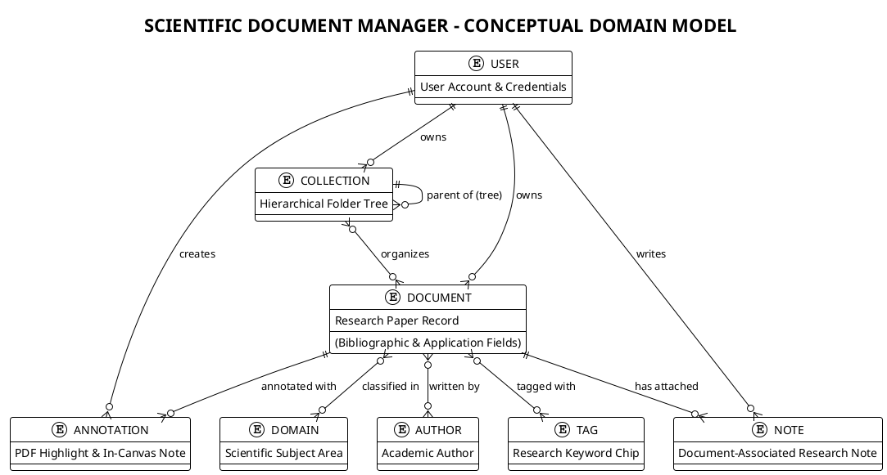

---

### 4.2. Application-Level Relational Database Schema

> [!NOTE]
> The schema below represents the application-level data model as implemented via Django ORM migrations. Django's `AbstractUser` base class adds additional authentication fields (e.g., `is_active`, `last_login`, `date_joined`) to the `USERS` table beyond what is shown. Only application-relevant fields are listed.

The complete relational schema implemented in PostgreSQL 16 via Django ORM distinguishes the 12 active midterm tables from the 3 post-midterm extension tables:

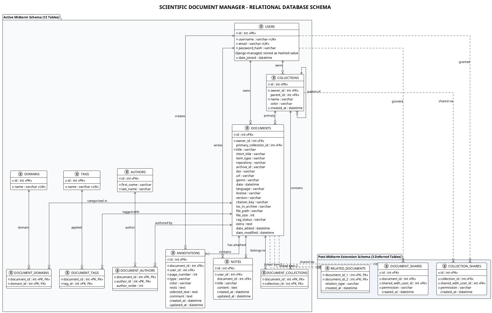

---

## 5. Detailed REST API Endpoints Specification

All endpoints follow RESTful design prefixed with `/api/v1/`:

### 5.1. Authentication & User Management

| Method | Endpoint | Description | Access Level |
| :--- | :--- | :--- | :--- |
| `POST` | `/api/v1/auth/register/` | Register new user account | Public |
| `POST` | `/api/v1/auth/token/` | Obtain JWT Access & Refresh token pair | Public |
| `POST` | `/api/v1/auth/token/refresh/` | Refresh Access token using Refresh token | Public |
| `POST` | `/api/v1/auth/logout/` | Logout and blacklist active Refresh token | Authenticated |
| `GET` | `/api/v1/auth/me/` | Retrieve current authenticated profile | Authenticated |

---

### 5.2. Documents & File Management

| Method | Endpoint | Parameters / Body | Description & Status |
| :--- | :--- | :--- | :--- |
| `GET` | `/api/v1/documents/` | `?collection_id=&tag=&search=&sort_by=&order=` | List documents owned by the authenticated researcher |
| `POST` | `/api/v1/documents/` | `multipart/form-data`: `file`, metadata fields | Create document, upload PDF (magic byte check, size <= 50MB, auto-triggers RAG indexing) |
| `GET` | `/api/v1/documents/{id}/` | URL param: `id` | Retrieve all document-level application and bibliographic metadata fields and relations |
| `PUT` / `PATCH` | `/api/v1/documents/{id}/` | JSON metadata fields to update | Update metadata (Authenticated researcher) |
| `DELETE` | `/api/v1/documents/{id}/` | - | Delete document owned by the authenticated researcher |
| `GET` | `/api/v1/documents/{id}/download/` | - | Stream/download physical PDF file (Authenticated researcher) |

---

### 5.3. Automated Metadata Lookup (Crossref DOI)

| Method | Endpoint | Request Body | Business Logic |
| :--- | :--- | :--- | :--- |
| `POST` | `/api/v1/metadata/lookup-doi/` | `{ "doi": "10.xxxx/example-doi" }` | Call **Crossref REST API** to retrieve and normalize available bibliographic metadata (title, authors, DOI, publication date, URL, and related identifiers) |

---

### 5.4. Collections Tree Management

| Method | Endpoint | Request Body | Description |
| :--- | :--- | :--- | :--- |
| `GET` | `/api/v1/collections/tree/` | - | Retrieve hierarchical nested collection tree (Single-query in-memory builder) |
| `POST` | `/api/v1/collections/` | `{ "name": "AI Research", "parent_id": 1, "color": "#3b82f6" }` | Create root collection or child folder |
| `PATCH` | `/api/v1/collections/{id}/` | `{ "name": "Deep Learning", "color": "#10b981" }` | Rename, recolor, or move folder in tree |
| `DELETE` | `/api/v1/collections/{id}/` | - | Delete collection folder |
| `POST` | `/api/v1/collections/{id}/add-documents/` | `{ "document_ids": [12, 15] }` | Assign documents to collection |

---

### 5.5. PDF Annotations & Sticky Notes

| Method | Endpoint | Request Body | Description |
| :--- | :--- | :--- | :--- |
| `GET` | `/api/v1/documents/{doc_id}/annotations/` | `?page_number=` | List highlights and notes for specified document |
| `POST` | `/api/v1/documents/{doc_id}/annotations/` | `{ "page_number": 2, "type": "highlight", "color": "#ffeb3b", "rects": [{"x": 100, "y": 200, "width": 50, "height": 15}], "selected_text": "...", "comment": "..." }` | Create in-canvas highlight or sticky note (Authenticated researcher). Note: `rects` is stored as `text` (JSON-serialized array) in the current Django model. |
| `PATCH` | `/api/v1/annotations/{id}/` | `{ "color": "#f43f5e", "comment": "Updated note..." }` | Update annotation color or comment |
| `DELETE` | `/api/v1/annotations/{id}/` | - | Delete annotation |

---

### 5.6. AI Assistant & Local RAG Pipeline

> [!IMPORTANT]
> The following endpoints are part of the active RAG implementation plan (Tasks RAG-1 through RAG-3). They are documented here as the target API specification. Mark as implemented once backend services are complete and tested.

| Method | Endpoint | Request Body | Description | Status |
| :--- | :--- | :--- | :--- | :---: |
| `GET` | `/api/v1/documents/semantic-search/` | `?q=<query>` | Semantic search over the researcher's document library using embedding-based retrieval; returns matching documents ranked by relevance with snippet context | 🔧 In Development |
| `POST` | `/api/v1/documents/{id}/chat/` | `{ "question": "..." }` | Document-scoped RAG Q&A: retrieves evidence only from the active document and returns an answer with page citations (`sources: [{ page, chunk_id }]`) | 🔧 In Development |
| `POST` | `/api/v1/documents/{id}/summarize/` | `{ "mode": "quick" }` | AI-assisted summary generated from retrieved representative document chunks (selected sections/abstract) | 📋 Planned |
| `POST` | `/api/v1/documents/{id}/reindex/` | - | Re-extract, chunk, and re-index document vectors into Qdrant | 📋 Planned |

---

### 5.7. [Post-Midterm Extension] Collaboration, Sharing & Related Documents (Planned Roadmap)

> [!NOTE]
> **Post-Midterm Features:** The following endpoints represent a **planned extension** and are **not part of the current midterm implementation**. Multi-user peer collaboration (`VIEW`, `COMMENT`, `EDIT`), live invitation links, and bidirectional paper linking (`RELATED_DOCUMENTS`) are formally deferred to post-midterm releases.

| Method | Endpoint | Request Body | Description |
| :--- | :--- | :--- | :--- |
| `GET` | `/api/v1/documents/{id}/shares/` | - | List collaborators with active access on document |
| `POST` | `/api/v1/documents/{id}/shares/` | `{ "email": "colleague@univ.edu", "permission": "EDIT" }` | Grant `VIEW`, `COMMENT`, or `EDIT` access |
| `DELETE` | `/api/v1/documents/{id}/shares/{share_id}/` | - | Revoke collaborator access |
| `POST` | `/api/v1/collections/{id}/shares/` | `{ "email": "colleague@univ.edu", "permission": "VIEW" }` | Share entire collection folder with inheritance |
| `GET` | `/api/v1/shares/shared-with-me/` | - | Retrieve all documents and folders shared with current user |
| `GET` | `/api/v1/documents/{id}/related/` | - | Retrieve list of manually associated research papers |
| `POST` | `/api/v1/documents/{id}/related/` | `{ "related_document_id": 14, "relation_type": "manual" }` | Link two papers as related items |

---

## 6. Vector Database Schema Design (Qdrant Embedded)

Vector storage for the embedded RAG pipeline is configured via **Qdrant Embedded** (`qdrant-client` path storage at `media/qdrant_db/`):

1. **Collection Name**: `scientific_document_chunks`
2. **Vector Configuration**:
   - `size`: **384** (matching `sentence-transformers/all-MiniLM-L6-v2`).
   - `distance`: **`Cosine`**.
3. **Payload Structure** (Metadata attached to each chunk point):
   ```json
   {
     "doc_id": 42,
     "page_number": 3,
     "chunk_id": "doc_42_p3_c1",
     "chunk_index": 1,
     "text": "The experimental setup comprises a dense neural network evaluated on the ImageNet benchmark...",
     "char_count": 860,
     "created_at": "2026-09-22T14:30:00Z"
   }
   ```
4. **Payload Indexing**:
   - Payload indexes enabled on `doc_id` (Integer) and `page_number` (Integer) to support efficient filtered retrieval. (Note: Qdrant's payload indexes are distinct from its HNSW vector index.)
   - Filter query `filter={"must": [{"key": "doc_id", "match": {"value": active_doc_id}}]}` restricts retrieval to chunks belonging to the active document, preventing unrelated documents from being included in the Q&A context.
   - **Authorization note:** Qdrant is a derived retrieval store and is not the source of truth for ownership. PostgreSQL is used to determine the authenticated researcher's accessible document IDs before retrieval. Qdrant is then filtered to only those document IDs, ensuring vector retrieval is naturally scoped to the researcher's own library.

---

## Appendix A — Post-Midterm Extension Design

> [!NOTE]
> The diagrams and API endpoints in this appendix describe **planned future features** that are **not part of the midterm implementation**. They are retained here as design specifications for post-midterm development.

### A.1. [Post-Midterm] Sequence Diagram: Collaboration & Document Sharing

Multi-user peer collaboration, email invitation flows, and live `VIEW` / `COMMENT` / `EDIT` permissions are formally deferred to post-midterm releases. This sequence illustrates the planned design for future multi-user extension.

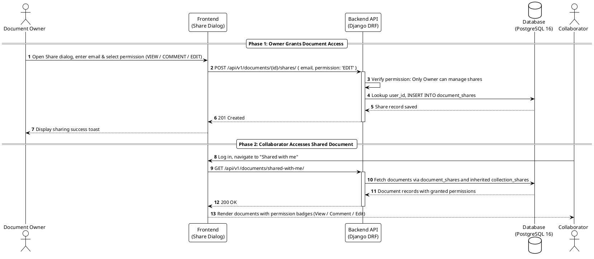

---

### A.2. [Post-Midterm Extension] Sequence Diagram: Semantic Library Search (PlantUML)

While the active midterm UI demonstrates keyword filtering and document-scoped RAG Q&A, library-wide semantic search across the entire vector repository is designed as an extension capability. This sequence illustrates natural-language query routing, PostgreSQL ownership pre-filtering, and Qdrant chunk retrieval:

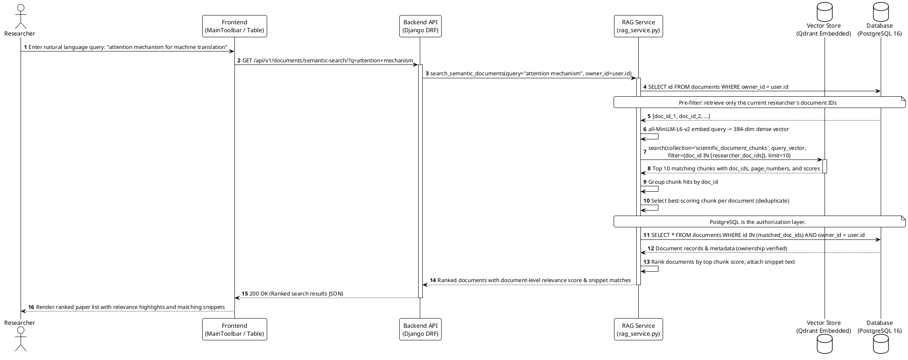

