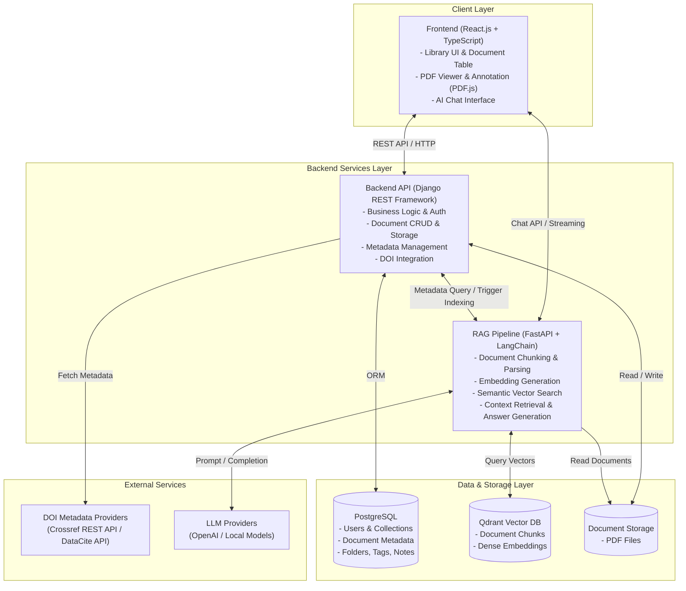

# Hệ Thống Quản Lý Tài Liệu Khoa Học (Scientific Document Manager)

Hệ thống quản lý tài liệu nghiên cứu khoa học, hỗ trợ đọc, chú thích PDF, tự động trích xuất metadata và tích hợp trợ lý AI thông minh (RAG) phục vụ tra cứu và hỏi đáp chuyên sâu trên tài liệu.

---

## 1. Tổng quan kiến trúc hệ thống

Hệ thống được chia làm **3 thành phần chính**:

* **Frontend (App) — React.js + TypeScript**: Giao diện quản lý tài liệu, xem PDF, tạo ghi chú/tag, chat và tương tác với AI.
* **Backend API — Django REST Framework (Python)**: Xử lý nghiệp vụ, quản lý metadata (tích hợp DOI), xác thực người dùng, upload/download tài liệu và quản lý thư viện.
* **RAG Pipeline — LangChain + FastAPI (microservice riêng)**: Xử lý tài liệu (chunking, embedding), truy xuất vector và sinh câu trả lời với mô hình ngôn ngữ lớn (LLM).

### Cơ sở dữ liệu

* **PostgreSQL**: Lưu trữ dữ liệu quan hệ gồm metadata tài liệu, thông tin người dùng, collections, folders, tags, và ghi chú/chú thích.
* **Vector Database (Qdrant)**: Lưu trữ embedding vectors của các chunks nội dung tài liệu phục vụ tìm kiếm ngữ nghĩa và RAG.

---

### Sơ đồ kiến trúc tổng thể (Architecture Diagram)



---

## 2. Công nghệ chi tiết

### 2.1. Website quản lý tài liệu

* **Backend**: **Django REST Framework (DRF)** — Quen thuộc, phát triển nhanh, có sẵn hệ thống Admin mạnh mẽ, ORM hoàn thiện và bảo mật cao.
* **Frontend**: **React.js + TypeScript** — Linh hoạt, hệ sinh thái phong phú, dễ tích hợp các thư viện UI và PDF viewer.
* **PDF Viewer & Annotation**: **PDF.js** (open-source, phổ biến hàng đầu) hoặc **pdfAnnotate** để hỗ trợ xem tài liệu, tạo ghi chú, highlight trực tiếp trên trang PDF.
* **DOI Metadata**: Gọi **Crossref REST API** (hoàn toàn miễn phí, không yêu cầu API key) hoặc **DataCite API** để tự động tìm nạp và điền đầy đủ metadata bài báo khoa học dựa trên mã DOI.

### 2.2. RAG Pipeline & Trợ lý AI

* **Microservice**: **FastAPI** — Hiệu năng cao, hỗ trợ bất đồng bộ (async), streaming response phù hợp cho giao tiếp Chatbot/AI.
* **Framework RAG**: **LangChain** — Quản lý chuỗi xử lý tài liệu, text splitter, embedding model và prompt templates.
* **Vector Database**: **Qdrant** — Cơ sở dữ liệu vector mã nguồn mở, tốc độ cao, dễ triển khai qua Docker và tối ưu cho tìm kiếm tương đồng (similarity search).

### 2.3. Cơ sở dữ liệu & Lưu trữ

* **PostgreSQL**: Đảm bảo toàn vẹn dữ liệu quan hệ (ACID), lưu trữ phân cấp folder, collection, quan hệ nhiều-nhiều giữa tags và documents.
* **Qdrant Vector DB**: Lưu trữ embeddings kèm payload metadata (document_id, page_number, chunk_id).
* **Storage**: Lưu trữ tệp PDF gốc an toàn trên local filesystem hoặc object storage (S3-compatible).

---

## 3. Cấu trúc dự án (Repository Structure)

```text
DACNTT/
├── frontend/             # Ứng dụng Frontend (React.js + TypeScript + Vite)
│   ├── src/
│   │   ├── components/   # UI components (TabBar, Sidebar, DocumentTable, MetadataPanel, PdfViewer)
│   │   ├── types/        # TypeScript interfaces & types
│   │   └── data/         # Mock data & state management
│   ├── package.json
│   └── vite.config.ts
│
├── backend/              # [Kế hoạch] Django REST Framework Backend API
│   ├── manage.py
│   ├── core/             # Cấu hình dự án Django
│   ├── documents/        # App quản lý tài liệu, metadata, DOI
│   └── users/            # App quản lý người dùng & phân quyền
│
├── rag_pipeline/         # [Kế hoạch] FastAPI + LangChain Microservice
│   ├── app/
│   │   ├── api/          # Endpoints (ingest, query, chat)
│   │   ├── chains/       # LangChain retrieval & QA chains
│   │   └── core/         # Vector DB (Qdrant) connection & embeddings
│   └── requirements.txt
│
├── docs/                 # Tài liệu thiết kế kiến trúc & hướng dẫn
└── README.md
```

---

## 4. Hướng dẫn chạy Frontend hiện tại

```bash
cd frontend
npm install
npm run dev
```
Ứng dụng sẽ khởi chạy tại `http://localhost:5173/`.
