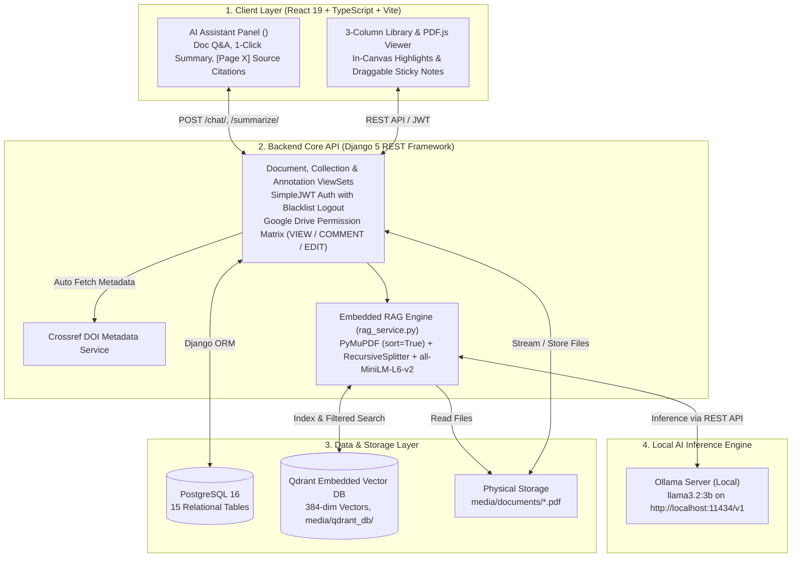

# Scientific Document Manager (Zotero Style with Local AI & Collaboration)

An advanced scientific document management system inspired by **Zotero**, designed for researchers, academics, and students. The platform integrates native PDF reading and in-canvas annotations, automated academic metadata extraction (Crossref DOI), Google Drive-style sharing permissions, and a locally hosted **Retrieval-Augmented Generation (RAG) AI Assistant** for grounded document Q&A and 1-click summarization.

---

## 1. Core Features

- 📚 **Zotero-style 3-Column Workspace**:
  - **Left Sidebar**: Hierarchical collection folders (nested trees), interactive tags list with hover counters, and default library filters (*Recently Read, My Publications, Duplicates, Trash*).
  - **Center Panel**: High-performance sortable document table, instant search (`Ctrl+F`), and filtering by tags, authors, domains, and color categories.
  - **Right Sidebar**: In-place editable panel managing 22 standardized academic metadata fields.
- ⚡ **Automated Metadata Extraction (DOI Lookup)**:
  - Instant metadata auto-fill via **Crossref REST API** (Title, Authors, Journal, Publication Year, Abstract).
- 📑 **Integrated PDF.js Reader & In-Canvas Annotations**:
  - Academic two-column text rendering with high-accuracy TextLayer.
  - In-canvas text highlighting and draggable, boundary-clamped sticky notes.
  - Smooth Ctrl+Scroll zoom, text search in PDF, and sidebar annotation management.
- 👥 **Google Drive-Style Collaboration & Sharing**:
  - User identity managed via JWT authentication (`djangorestframework-simplejwt`) with token rotation and blacklist logout.
  - Granular document-level and folder-level sharing inheritance with 3 permission tiers: `VIEW`, `COMMENT`, and `EDIT`.
- 🤖 **Embedded Local RAG AI Assistant**:
  - **Layout-Aware PDF Ingestion**: `PyMuPDF` (`fitz`) extraction with coordinate-based sorting (`sort=True`) preserving academic reading order.
  - **Semantic Chunking**: `RecursiveCharacterTextSplitter` (chunk size: 900, overlap: 150).
  - **Dense Embeddings**: `all-MiniLM-L6-v2` (384-dimensional dense vectors, lightweight CPU inference).
  - **Local Vector Store**: `Qdrant Embedded` (`media/qdrant_db/`) with payload indexing on `doc_id` and `page_number`.
  - **Local LLM**: `Ollama` running `llama3.2:3b` over OpenAI-compatible REST endpoints.
  - **Interactive Citations**: Answers cite `[Page X]` badges; clicking a badge smoothly scrolls the PDF viewer directly to the source page.

---

## 2. High-Level Architecture

For complete UML diagrams, sequence diagrams, 15-table relational ERD, and REST API specifications, refer to [ARCHITECTURE.md](file:///c:/DACNTT/ARCHITECTURE.md).



---

## 3. Development Roadmap & Status

| Phase | Milestone | Status | Key Deliverables |
| :--- | :--- | :---: | :--- |
| **Phase 1** | **Architecture & Specifications** | 🟢 **100% Done** | Requirements, ERD (15 tables), REST API specs, and Qdrant schema documented in [ARCHITECTURE.md](file:///c:/DACNTT/ARCHITECTURE.md). |
| **Phase 2** | **Backend Core & Crossref DOI** | 🟢 **100% Done** | Django 5 setup, 15 models, JWT authentication, Google Drive sharing permissions, Crossref service, Bruno API collection. |
| **Phase 3** | **Frontend UI & PDF Viewer** | 🟢 **100% Done** | React 19 3-column Zotero UI, PDF.js integration, in-canvas annotations, DOI preview modal, collection tree CRUD, and unified runner. |
| **Phase 3.5 - 3.8** | **Full Monorepo Audit & Refactoring** | 🟢 **100% Done** | Security fixes, JWT token blacklist logout, Axios refresh queue, N+1 query optimization, magic byte upload validation (`%PDF-`), 19/19 backend tests passing. |
| **Phase 4.1** | **Midterm Scope Audit & Alignment** | 🟢 **100% Done** | Scope reduction, dropped non-essential features, frozen desktop-grade PDF viewer, locked RAG stack (PyMuPDF `sort=True`, Qdrant, Ollama `llama3.2:3b`). |
| **Phase 4.2** | **Local RAG Pipeline Implementation** | 🚀 **In Progress** | `RAG-1` (PDF extraction & chunking), `RAG-2` (Vector store indexing), `RAG-3` (Doc Q&A & summary API), `RAG-4` (`<AiChatPanel>`), `RAG-5` (Evaluation benchmark). |

---

## 4. Quick Start Guide

For comprehensive setup prerequisites, database configuration, environment variables, and troubleshooting, please read:  
👉 **[SETUP.md](file:///c:/DACNTT/SETUP.md)**

### Summary Commands:

#### 1. Backend Setup (Django REST API):
```bash
cd backend
python -m venv venv
.\venv\Scripts\activate          # Windows PowerShell (or source venv/bin/activate on macOS/Linux)
pip install -r requirements.txt
Copy-Item .env.example .env      # Configure DB_PASSWORD in .env
python manage.py migrate
python manage.py test apps.documents.tests apps.users.tests
python manage.py runserver
```
Backend runs at: `http://127.0.0.1:8000/`

#### 2. Frontend Setup (React 19 + Vite):
```bash
cd frontend
npm install
npm run build                    # Verify production build
npm run dev
```
Frontend runs at: `http://localhost:5173/`

#### 3. Run Everything with One Command:
```bash
# In the repository root:
npm start
```
