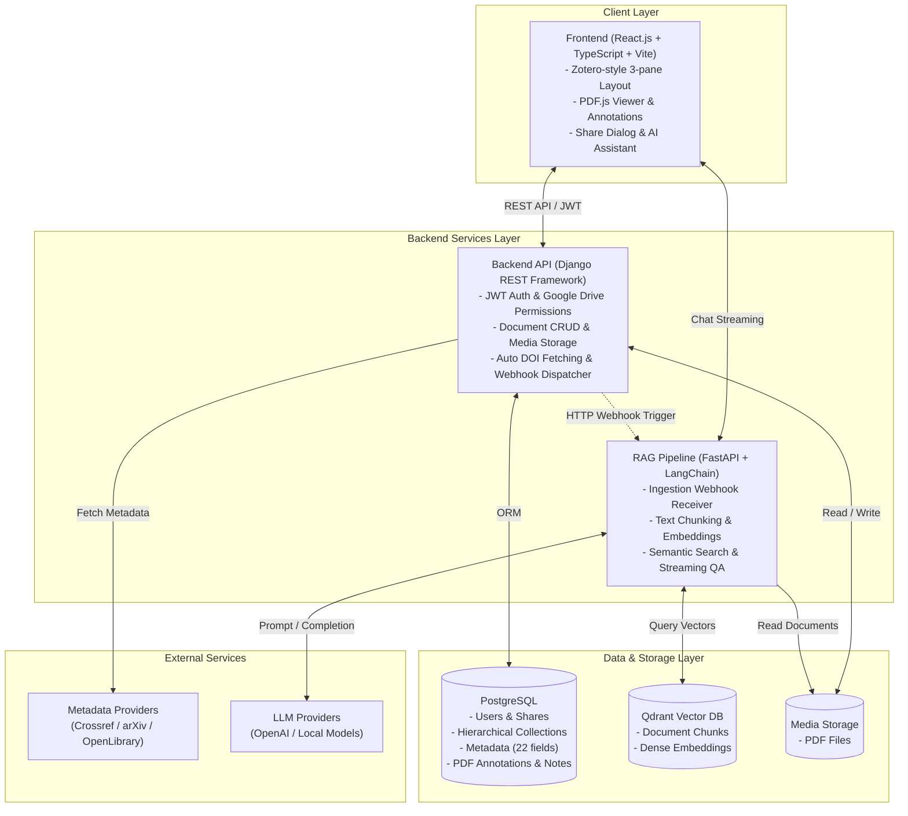

# Hệ Thống Quản Lý Tài Liệu Khoa Học (Scientific Document Manager)

Hệ thống quản lý tài liệu nghiên cứu khoa học chuyên sâu lấy cảm hứng từ **Zotero**, hỗ trợ đọc và chú thích PDF trực tiếp, tự động trích xuất metadata (DOI, ISBN, arXiv), phân quyền chia sẻ thư viện (Google Drive-style), và tích hợp trợ lý AI thông minh (RAG Pipeline) phục vụ tra cứu và hỏi đáp chuyên sâu trên tài liệu.

---

## 1. Tính năng Nổi bật (Core Features)

- 📚 **Giao diện Quản lý 3 cột chuẩn Zotero**:
  - Cột trái: Cây thư mục phân cấp (`Collections` lồng nhau), danh sách thẻ (`Tags`), mục tài liệu hệ thống (*Recently Read, My Publications, Duplicates, Trash*).
  - Cột giữa: Bảng tài liệu đa năng với khả năng sắp xếp, tìm kiếm tức thì (`Ctrl+F`), lọc theo nhãn/tác giả/lĩnh vực/màu sắc.
  - Cột phải: Panel xem và chỉnh sửa in-place 22 trường metadata khoa học chuẩn mực.
- ⚡ **Tự động trích xuất Metadata (Auto-Identifier Lookup)**:
  - Tự động điền metadata chuẩn xác từ mã **DOI** (qua *Crossref REST API*), **ISBN** (qua *OpenLibrary*), hoặc **arXiv ID** (qua *arXiv Export API*).
- 📑 **Trình đọc & Chú thích PDF trực quan (PDF.js)**:
  - Hiển thị văn bản PDF nhiều trang với Text-layer chuẩn.
  - Tô sáng (Highlight) trực tiếp trên trang PDF và tạo ghi chú cố định (Sticky Note / Page Note).
  - Tìm kiếm toàn văn (Search in PDF) và chuyển trang nhanh.
- 👥 **Phân quyền & Chia sẻ thư viện (Google Drive-style Collaboration)**:
  - Phân quyền theo tài khoản người dùng (`JWT Authentication`).
  - Chia sẻ từng tài liệu hoặc chia sẻ cả thư mục (tài liệu con tự động thừa hưởng quyền) với 3 cấp độ: `VIEW` (Chỉ xem), `COMMENT` (Bình luận/Annotation), và `EDIT` (Chỉnh sửa metadata/quản lý file).
- 📝 **Ghi chú Nghiên cứu Cá nhân (Personal Research Notes)**:
  - Quản lý ghi chú độc lập hoặc đính kèm vào từng bài báo nghiên cứu.
- 🔗 **Liên kết Bài viết Liên quan (Related Items)**:
  - Liên kết thủ công giữa các bài báo có phương pháp tương đồng hoặc tự động gợi ý cùng tác giả/lab/lĩnh vực.
- 🤖 **Trợ lý AI & RAG Pipeline**:
  - Hỏi đáp (Q&A) ngữ cảnh chuyên sâu trên từng bài báo.
  - Hỏi đáp bài nghiên cứu mới nhất theo `#tag` trong bộ sưu tập.
  - Tự động tóm tắt bài báo và tóm tắt hướng nghiên cứu của tác giả.

---

## 2. Kiến trúc Tổng thể Hệ thống

Chi tiết sơ đồ Use Case, Sequence Diagrams, ERD 15 bảng và đặc tả REST API xem tại [ARCHITECTURE.md](file:///c:/DACNTT/ARCHITECTURE.md).



---

## 3. Lộ Trình Triển Khai 4 Tuần & Tiến Độ

| Tuần | Mục tiêu | Trạng thái hiện tại |
| :--- | :--- | :---: |
| **Tuần 1: Phân tích & Thiết kế** | Hoàn thiện đặc tả yêu cầu, Use Case, Sequence Diagram, ERD 15 bảng, đặc tả REST API, Schema Qdrant Vector Store. | 🟢 **Hoàn thành 100%** (Xem [ARCHITECTURE.md](file:///c:/DACNTT/ARCHITECTURE.md)) |
| **Tuần 2: Backend Core & DOI** | Cài đặt DRF, PostgreSQL, xây dựng Models 15 bảng, API Upload, tích hợp Crossref API, JWT Auth & Permissions, Unit Tests (6/6 passed), Bruno Collection. | 🟢 **Hoàn thành 100%** (Xem `backend/`) |
| **Tuần 3: Frontend & PDF Viewer** | Kết nối React với DRF qua `axios`, tích hợp `pdfjs-dist` thật, chức năng Highlight & Sticky Note trên trang PDF. | 🟡 **Khung UI sẵn sàng**, bước tiếp theo |
| **Tuần 4: Tổ chức Thư viện & Tìm kiếm** | Cây thư mục lồng nhau (`Collections Tree`), Gắn thẻ, Tìm kiếm nâng cao đa tiêu chí, chia sẻ Google Drive. | 🟡 **Khung UI sẵn sàng**, bước tiếp theo |

---

## 4. Hướng dẫn Cài đặt & Khởi chạy (Quick Start)

Chi tiết đầy đủ các bước cài đặt môi trường, cấu hình cơ sở dữ liệu PostgreSQL, biến môi trường `.env`, cấu hình IDE và giải quyết sự cố, vui lòng xem tại:  
👉 **[SETUP.md](file:///c:/DACNTT/SETUP.md)**

### Tóm tắt nhanh các bước:

#### Khởi chạy Backend (Django API):
```bash
cd backend
python -m venv venv
.\venv\Scripts\activate   # Windows (hoặc source venv/bin/activate trên macOS/Linux)
pip install -r requirements.txt
Copy-Item .env.example .env   # Cập nhật thông tin DB_PASSWORD trong .env
python manage.py migrate
python manage.py runserver
```
Backend chạy tại: `http://127.0.0.1:8000/`

#### Khởi chạy Frontend (React + Vite):
```bash
cd frontend
npm install
npm run dev
```
Frontend chạy tại: `http://localhost:5173/`
