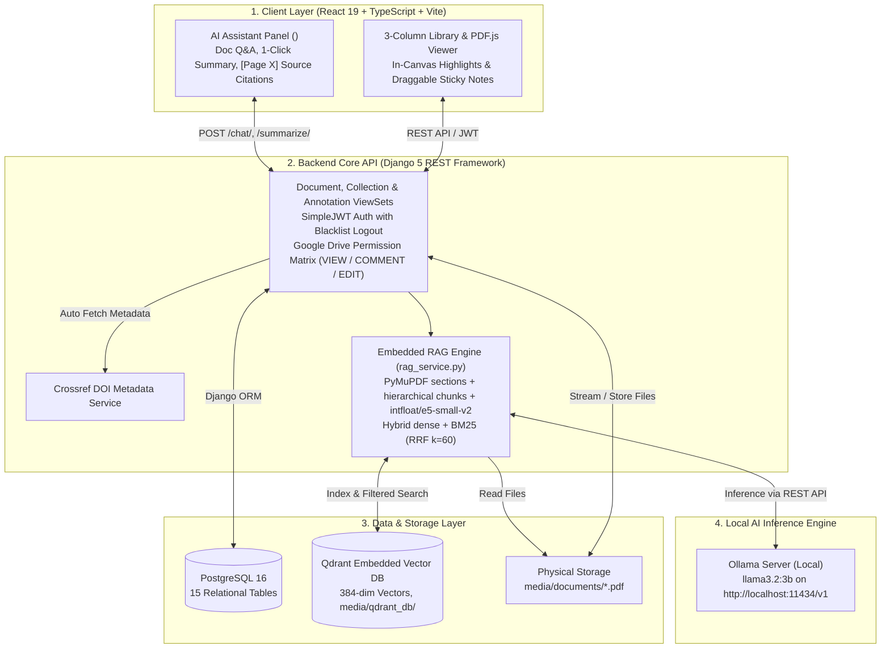

# Scientific Document Manager (Zotero Style with Local AI & Collaboration)

An advanced scientific document management system inspired by **Zotero**, designed for researchers, academics, and students. The platform integrates native PDF reading and in-canvas annotations, automated academic metadata extraction (Crossref DOI), Google Drive-style sharing permissions, and a locally hosted **Retrieval-Augmented Generation (RAG) AI Assistant** for grounded document Q&A and 1-click summarization.

---

## 0. Research Questions (RQ) & Scope

This project implements and evaluates a Scientific Document Management platform with a locally hosted RAG assistant designed for academic literature. The thesis ([`DU_AN_CNTT_TOAN_VAN.md`](DU_AN_CNTT_TOAN_VAN.md)) evaluates each RAG component in isolation on the QASPER benchmark:

| RQ | Question | Status | Main result |
| :--- | :--- | :--- | :--- |
| **RQ1** | Which local PDF extractor suits scientific papers? (47 Dev papers) | Done | Top four extractors are statistically tied on downstream nDCG@10; `pymupdf_layout` chosen because it alone recovers headings (Heading F1 48.01%). |
| **RQ2** | Which chunking strategy retrieves best under a 1,600-token budget? (47 papers) | Done | `hierarchical` (Small-to-Big) scores highest (nDCG@10 0.6880), partly because it is scored on whole parent sections. |
| **RQ3** | Which open-source embedding model (≤335M params) is best on desktop CPU? (207 papers, 10 dense models + BM25) | Done | `modernbert-embed-base` most accurate (0.5872); `intfloat/e5-small-v2` best balance (0.5522, 30 ms) and used in production. |
| **RQ4** | Does hybrid retrieval beat dense-only? (QASPER Test, 408 papers) | Done | Convex α=0.7 +0.0152 nDCG@10 (p_adj 0.014); production RRF k=60 not significantly different from dense. |
| **RQ5** | How do `qwen2.5:0.5b`, `llama3.2:1b`, `llama3.2:3b` compare given gold evidence? (500 questions + 60-answer audit) | Done | `llama3.2:3b` beats 1b on Token F1; qwen has higher F1 but more unsupported answers in the human audit (7/20 vs 1/20). |
| **RQ6** | End-to-end combinations (3 embedding models × 3 LLMs on retrieved context) | **Not executed (future work)** | — |

### Research Limitations & Assumptions:
1. **Language Boundary**: English-only scientific literature (QASPER: NLP/ML arXiv papers).
2. **Component-level evaluation**: Results of RQ1–RQ5 do not add up to an end-to-end quality figure; RQ5 uses gold evidence instead of retrieved context.
3. **Hardware Constraints**: Commodity desktop deployment (AMD Ryzen 5 5600, 16 GB RAM, CPU only, local Ollama).

---

## 1. Core Features

- 📚 **Zotero-style 3-Column Workspace**:
  - **Left Sidebar**: Hierarchical collection folders (nested trees), interactive tags list with hover counters, and default library filters (*Recently Read, My Publications, Duplicates, Trash*).
  - **Center Panel**: High-performance sortable document table, instant search (`Ctrl+F`), and filtering by tags, authors, domains, and color categories.
  - **Right Sidebar**: In-place editable panel managing 22 standardized academic metadata fields.
- ⚡ **Automated Metadata Extraction (DOI & PDF Lookup)**:
  - "Add from DOI" auto-fill via **Crossref REST API** with OpenAlex fallback (Title, Authors, Journal, Publication Year, Abstract).
  - Local PDF layout heuristic extractor on upload (title, authors, abstract, DOI/arXiv ID) for preview and editing; GROBID is optional (`USE_GROBID`, off by default).
- 📑 **Integrated PDF.js Reader & In-Canvas Annotations**:
  - Academic two-column text rendering with high-accuracy TextLayer.
  - In-canvas text highlighting and draggable, boundary-clamped sticky notes.
  - Smooth Ctrl+Scroll zoom, text search in PDF, and sidebar annotation management.
- 👥 **Google Drive-Style Collaboration & Sharing**:
  - User identity managed via JWT authentication (`djangorestframework-simplejwt`) with token rotation and blacklist logout.
  - Document-level and folder-level sharing inheritance with 3 permission tiers enforced by the API: `VIEW` (read, chat, summarize), `COMMENT` (+ annotations), `EDIT` (+ metadata edits); delete, trash, duplicate, reindex and share management are owner-only. There is no sharing UI yet (REST API only).
- 🤖 **Embedded Local RAG AI Assistant**:
  - **Layout-Aware PDF Ingestion (RQ1)**: `PyMuPDF` (`fitz`) section extraction with typographic heading detection and coordinate sorting.
  - **Hierarchical Chunking (RQ2)**: Small-to-Big children (~200 estimated tokens, overlap 40) linked to parent sections stored in a vectorless companion collection (`chunking_utils.py`, `CHUNKING_STRATEGY=hierarchical`).
  - **Dense Embeddings (RQ3)**: Champion model `intfloat/e5-small-v2` (384-dimensional dense vectors with asymmetric prefix support) & `SentenceTransformer`.
  - **Hybrid Retrieval (RQ4)**: Reciprocal Rank Fusion (RRF $k=60$) combining dense cosine similarity and sparse `BM25Okapi`.
  - **Local Vector Store**: `Qdrant Embedded` (`media/qdrant_db/`) with document-scoped payload filtering.
  - **Refusal threshold**: if the best dense cosine score among the selected contexts is below `RAG_MIN_SIMILARITY_SCORE = 0.80`, the assistant refuses without calling the LLM.
  - **Local LLM (RQ5)**: `Ollama` running `llama3.2:3b` over local REST endpoints with grounded academic prompts; if Ollama is unreachable, the API returns the top retrieved snippets instead.
  - **Interactive Citations**: Answers cite `[Page X]` badges; clicking a badge smoothly scrolls the PDF viewer directly to the source page.

---

## 2. High-Level Architecture

For complete UML diagrams, sequence diagrams, 15-table relational ERD, and REST API specifications, refer to [ARCHITECTURE.md](ARCHITECTURE.md).


```mermaid
flowchart TB
    subgraph ClientLayer ["1. Client Layer (React 19 + TypeScript + Vite)"]
        FE_UI["3-Column Library & PDF.js Viewer\nIn-Canvas Highlights & Draggable Sticky Notes"]
        FE_AI["AI Assistant Panel (<AiChatPanel>)\nDoc Q&A, 1-Click Summary, [Page X] Source Citations"]
    end

    subgraph BackendLayer ["2. Backend Core API (Django 5 REST Framework)"]
        BE_API["Document, Collection & Annotation ViewSets\nSimpleJWT Auth with Blacklist Logout\nGoogle Drive Permission Matrix (VIEW / COMMENT / EDIT)"]
        BE_DOI["Crossref DOI Metadata Service"]
        BE_RAG["Embedded RAG Engine (rag_service.py)\nPyMuPDF sections + hierarchical chunks + intfloat/e5-small-v2\nHybrid dense + BM25 (RRF k=60)"]
    end

    subgraph DataLayer ["3. Data & Storage Layer"]
        PG[("PostgreSQL 16\n15 Relational Tables")]
        QD[("Qdrant Embedded Vector DB\n384-dim Vectors, media/qdrant_db/")]
        FS["Physical Storage\nmedia/documents/*.pdf"]
    end

    subgraph LocalAI ["4. Local AI Inference Engine"]
        OLLAMA["Ollama Server (Local)\nllama3.2:3b on http://localhost:11434/v1"]
    end

    FE_UI <-->|REST API / JWT| BE_API
    FE_AI <-->|POST /chat/, /summarize/| BE_API
    BE_API -->|Auto Fetch Metadata| BE_DOI
    BE_API <-->|Django ORM| PG
    BE_API <-->|Stream / Store Files| FS
    BE_API --> BE_RAG
    BE_RAG <-->|Index & Filtered Search| QD
    BE_RAG <-->|Inference via REST API| OLLAMA
    BE_RAG -->|Read Files| FS
```

---

## 3. Development Roadmap & Status

| Phase | Milestone | Status | Key Deliverables |
| :--- | :--- | :---: | :--- |
| **Phase 1** | **Architecture & Specifications** | 🟢 **100% Done** | Requirements, ERD (15 tables), REST API specs, and Qdrant schema documented in [ARCHITECTURE.md](ARCHITECTURE.md). |
| **Phase 2** | **Backend Core & Crossref DOI** | 🟢 **100% Done** | Django 5 setup, 15 models, JWT authentication, Google Drive sharing permissions, Crossref service, Bruno API collection. |
| **Phase 3** | **Frontend UI & PDF Viewer** | 🟢 **100% Done** | React 19 3-column Zotero UI, PDF.js integration, in-canvas annotations, DOI preview modal, collection tree CRUD, and unified runner. |
| **Phase 3.5 - 3.8** | **Full Monorepo Audit & Refactoring** | 🟢 **100% Done** | Security fixes, JWT token blacklist logout, Axios refresh queue, N+1 query optimization, magic byte upload validation (`%PDF-`). |
| **Phase 4.1** | **Midterm Scope Audit & Alignment** | 🟢 **100% Done** | Scope reduction, dropped non-essential features, locked RAG stack (PyMuPDF, Qdrant, Ollama `llama3.2:3b`). |
| **Phase 4.2** | **Local RAG Pipeline Implementation** | 🟢 **100% Done** | Hierarchical indexing, hybrid RRF retrieval, `/chat/` and `/summarize/` endpoints, `<AiChatPanel>` with page citations. |
| **Phase 5** | **Empirical Evaluation (RQ1–RQ5) & Thesis** | 🟢 **Done** (RQ6 future work) | Benchmarks in `eval/`, thesis in `DU_AN_CNTT_TOAN_VAN.md`, audit in [`reports/audit/`](reports/audit/). Backend: 51 tests passing. |

---

## 4. Quick Start Guide

For comprehensive setup prerequisites, database configuration, environment variables, and troubleshooting, please read:  
👉 **[SETUP.md](SETUP.md)**

### Summary Commands:

#### 1. Backend Setup (Django REST API):
```bash
cd backend
python -m venv venv
.\venv\Scripts\activate          # Windows PowerShell (or source venv/bin/activate on macOS/Linux)
pip install -r requirements.txt
Copy-Item .env.example .env      # Configure DB_PASSWORD in .env
python manage.py migrate
python manage.py test apps.documents.tests apps.users.tests
python manage.py runserver
```
Backend runs at: `http://127.0.0.1:8000/`

#### 2. Frontend Setup (React 19 + Vite):
```bash
cd frontend
npm install
npm run build                    # Verify production build
npm run dev
```
Frontend runs at: `http://localhost:5173/`

#### 3. Run Everything with One Command:
```bash
# In the repository root:
npm start
```
